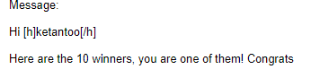

# Covid-19 Map based App
I made this for Topcoder's flutter competetion.
We were required to implement the Map functionality with some useful feature to go along with it.
It was also the one of the winning entry :)

### Updated Version with added features for 3rd Topcoder Challenge

https://github.com/TheKetan2/covid19_flutter_app_2

### API used:
https://covid19.mathdro.id/api/

### Flutter Libraries Used:
- http: ^0.12.0+4 for fetching data from API
- flutter_vector_icons: ^0.2.1 for icons 
- flutter_map: ^0.8.2 for implementing MapBox maps

# Screencast

