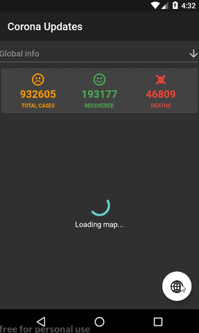

# Covid-19 App
I made this for Topcoder's flutter competetion.
We were required to implement the Map functionality with some useful feature to go along with it.

### API used:
https://covid19.mathdro.id/api/

### Flutter Libraries Used:
- http: ^0.12.0+4 for fetching data from API
- flutter_vector_icons: ^0.2.1 for icons 
- flutter_map: ^0.8.2 for implementing MapBox maps

# Screencast

